# Diagrama de flujo CI/CD

```mermaid
flowchart LR
    A["Git push a main<br/>(GitHub: mike1594/iac-final-app)"] --> B["GitHub Actions<br/>(.github/workflows/docker-publish.yml)"]
    B --> C["Docker build<br/>linux/amd64"]
    C --> D["Docker push<br/>jmeza17/iac-final-app:1.0.&lt;run_number&gt;"]
    D --> E["Gatillo: push a main / workflow_dispatch"]
    E --> F["Terraform init<br/>(backend remoto Azure Storage)"]
    F --> G["Terraform apply<br/>(revision Single, nueva imagen)"]
    G --> H["Azure Container App<br/>(ca-joe-meza-iac-app-dev-eus2-001)"]
    H --> I["Verificacion<br/>curl /hello y /secreto"]
```

## Descripcion del flujo

1. **Inicio / gatillo**: un `push` a la rama `main` del repositorio de codigo, o una ejecucion manual (`workflow_dispatch`).
2. **Build**: el workflow de GitHub Actions compila el microservicio Java y construye la imagen Docker para `linux/amd64`.
3. **Push de imagen**: se publica la imagen en DockerHub (`jmeza17/iac-final-app`) con tag automatico `1.0.<run_number>` (ademas de `latest` y el SHA del commit).
4. **IaC / deploy**: con el script `deploy.ps1` se ejecuta `terraform init` contra el backend remoto (Azure Storage privado) y `terraform apply`, que actualiza el Azure Container App a la nueva revision con la imagen publicada.
5. **Verificacion**: se consulta `https://<fqdn>/hello` (devuelve saludo) y `/secreto` (devuelve el secreto desde Key Vault).

## Herramientas

| Herramienta | Uso |
|---|---|
| GitHub + GitHub Actions | Repositorio y pipeline CI |
| Docker + DockerHub | Containerizacion y registro publico de imagen |
| Terraform (azurerm) | Infraestructura como codigo de Azure Container Apps |
| Azure Key Vault | Secreto expuesto en `/secreto` |
| Azure Storage | Backend remoto del estado de Terraform |
