# Diagrama de flujo CI/CD

```mermaid
flowchart LR
    A["Git push a main<br/>(GitHub: mike1594/iac-final-app)"] --> B["GitHub Actions<br/>(.github/workflows/docker-publish.yml)"]
    B --> C["Docker build<br/>linux/amd64"]
    C --> D["Docker push<br/>jmeza17/iac-final-app:1.0.&lt;run_number&gt;"]
    D --> E["Gatillo: push a main / workflow_dispatch"]
    E --> F["Terraform init<br/>(backend remoto Azure Storage)"]
    F --> G["Terraform apply<br/>(revision Single, nueva imagen)"]
    G --> H["Azure Container App<br/>(ca-joe-meza-iac-app-dev-eus2-001)"]
    H --> I["Verificacion<br/>curl /hello y /secreto"]
```

## Diagrama visual

<table>
  <tr>
    <td align="center" width="130">
       
      <strong>GitHub</strong> 
      mike1594/iac-final-app
    </td>
    <td align="center">&rarr; push a main</td>
    <td align="center" width="130">
       
      <strong>GitHub Actions</strong> 
      workflow_dispatch / push
    </td>
    <td align="center">&rarr; build</td>
    <td align="center" width="130">
       
      <strong>Docker Build</strong> 
      linux/amd64
    </td>
    <td align="center">&rarr; push tag</td>
    <td align="center" width="130">
       
      <strong>DockerHub</strong> 
      jmeza17/iac-final-app
    </td>
  </tr>
  <tr>
    <td colspan="7" align="center"> &darr; CD: script de despliegue <code>deploy.ps1</code></td>
  </tr>
  <tr>
    <td align="center" width="130">
       
      <strong>Terraform</strong> 
      init / apply
    </td>
    <td align="center">&rarr; estado remoto</td>
    <td align="center" width="130">
       
      <strong>Azure Storage</strong> 
      tfstate
    </td>
    <td align="center">&rarr; secreto</td>
    <td align="center" width="130">
       
      <strong>Key Vault</strong> 
      APP_SECRET
    </td>
    <td align="center">&rarr; deploy</td>
    <td align="center" width="130">
       
      <strong>Container App</strong> 
      /hello /secreto
    </td>
  </tr>
</table>

## Diagrama tecnico

## Descripcion del flujo

1. **Inicio / gatillo**: un `push` a la rama `main` del repositorio de codigo, o una ejecucion manual (`workflow_dispatch`).
2. **Build**: el workflow de GitHub Actions compila el microservicio Java y construye la imagen Docker para `linux/amd64`.
3. **Push de imagen**: se publica la imagen en DockerHub (`jmeza17/iac-final-app`) con tag automatico `1.0.<run_number>` (ademas de `latest` y el SHA del commit).
4. **IaC / deploy**: con el script `deploy.ps1` se ejecuta `terraform init` contra el backend remoto (Azure Storage privado) y `terraform apply`, que actualiza el Azure Container App a la nueva revision con la imagen publicada.
5. **Verificacion**: se consulta `https://<fqdn>/hello` (devuelve saludo) y `/secreto` (devuelve el secreto desde Key Vault).

## Herramientas

| Herramienta             | Uso                                                 |
| ----------------------- | --------------------------------------------------- |
| GitHub + GitHub Actions | Repositorio y pipeline CI                           |
| Docker + DockerHub      | Containerizacion y registro publico de imagen       |
| Terraform (azurerm)     | Infraestructura como codigo de Azure Container Apps |
| Azure Key Vault         | Secreto expuesto en `/secreto`                      |
| Azure Storage           | Backend remoto del estado de Terraform              |
